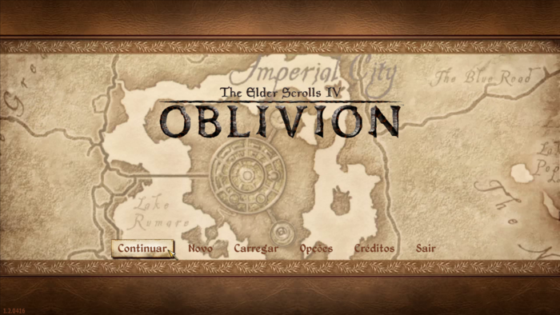
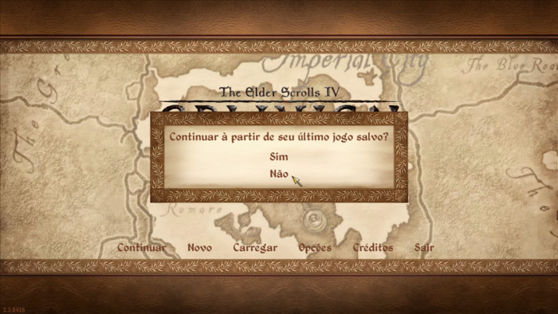
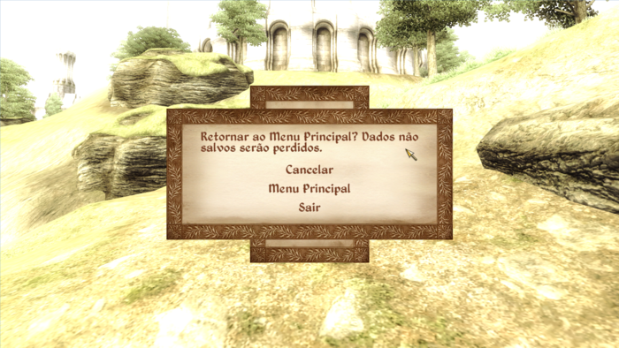

<div align="center">
  
  <br />
  <strong>Tradução para o jogo The Elder Scrolls IV: Oblivion</strong>
</div>

## Compatibilidade
- Plataforma: **PC**
- Versão: **1.2.0416**
- Idioma: **Inglês**

## Observações pré-instalação
- Apenas a versão **base** do jogo é traduzida
- A acentuação funciona normalmente
- Instalação escrita baseada na versão :link:[GOG do Oblivon](https://www.gog.com/en/game/elder_scrolls_iv_oblivion_game_of_the_year_edition_deluxe_the) <br />
Caso você use uma versão diferente, encontre a pasta raiz do jogo verificando a localização do **Oblivion.exe**

## Instalação
1. Baixe o arquivo de tradução :link:[aqui](https://github.com/juscelinodjj/tes-iv-oblivion-ptbr/archive/refs/heads/main.zip)
2. Extraia o arquivo de tradução `tes-iv-oblivion-ptbr-main.zip`
3. Após a extração, vá até à pasta `tes-iv-oblivion-ptbr-main` e mova a pasta `Data` para a pasta raiz do jogo em `C:\GOG Games\Oblivion`
4. Vá até a pasta `Documentos\My Games\Oblivion` e abra o arquivo `Oblivion.ini` com um editor de texto
5. No editor de texto, procure pela sessão `[Fonts]` e substitua seu conteúdo pelas linhas abaixo, salve a modificação e feche o editor de texto
``` ini
  SFontFile_1=Data\Fonts\Kingthings_Petrock_30.fnt
  SFontFile_2=Data\Fonts\Kingthings_Petrock_Outline_31.fnt
  SFontFile_3=Data\Fonts\Tahoma_16.fnt
  SFontFile_4=Data\Fonts\Daedric_Font.fnt
  SFontFile_5=Data\Fonts\Handwritten.fnt
```
6. Abra o Oblivion Launcher, vá em `Data Files` e ative `Oblivion_BR.esp (Player File)`, após isso inicie o jogo normalmente.

## Capturas de tela
<div>
  
  <br />
  
  <br />
  
  <br />
  
</div>

## Créditos
#### Equipe GameVicio Brasil®
- [Lista completa aqui](./.github/CREDITOS.md)

## Por que não usar o instalador comum?
O site GameVicio não disponibiliza mais a tradução. Além disso, todos os instaladores que encontrei em outros sites continham indicativos de malware.